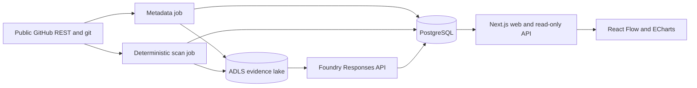

# Architecture

## Principles

1. Public GitHub repositories are an external, read-only source.
2. Deterministic evidence is separated from AI judgment.
3. Every result retains commit, tool/model, schema, and dataset lineage.
4. Azure-hosted components use managed identities.
5. AI and dashboard adapters are replaceable; evidence remains in open formats.
6. The browser receives bounded graph slices, never the whole estate.

## Runtime flow

The metadata job selects the stable cohort. The scanner works only at immutable
commit SHAs and deletes its checkout. The synthesizer receives bounded,
redacted evidence bundles and has no shell, browser, or GitHub write tools.

## Estate graph

The graph supports organization, ministry, portfolio, project, repository,
capability, technology, integration, proposed shared module, and Agentic
Workflow nodes. Ministry assignments inferred from public repository evidence
remain explicitly candidate-only. Every inferred edge carries confidence and
evidence IDs.

The server limits graph responses to 500 nodes. The browser starts from
aggregates and expands only the selected neighborhood. ELK calculates and caches
layout coordinates by dataset version.

## Future partnership path

A partner-approved GitHub App and webhooks can later improve freshness, but
scheduled reconciliation remains the correctness backstop. Write-capable
Agentic Workflows are explicitly out of scope until separately authorized.
